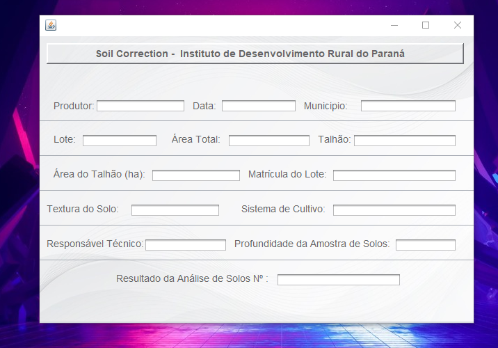
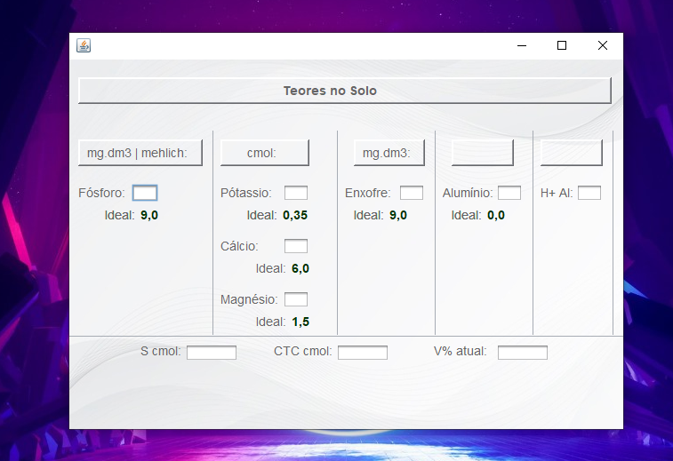
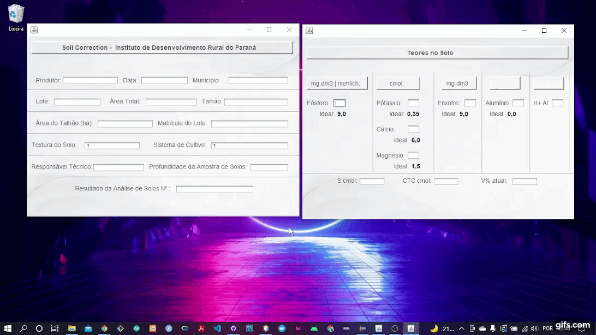

# Soil Correction - Interfaces

O objetivo deste projeto é o desenvolvimento de interfaces gráficas com o usuário (GUI) de uma ferramenta que tem como parceria o [Instituto de Desenvolvimento Rural do Paraná - IDR](http://www.idrparana.pr.gov.br/).

## Interfaces:

- Primeira interface, que tem como finalidade o cadastro de informações para a correção do solo. 
> 

- Segunda interface que tem como finalidade o cadastro de informações para a correção do solo.
> 

## Testes:

- Para a realização dos testes foi escolhido o tipo de teste manual, que foi realizado por simulações da interação do usuário com a interface.
> 

## Executar o projeto:

1. Faça download do projeto e descompacte os arquivos.
2. Inicie o NetBeans IDE.
3. Na IDE, escolha File> Open Projetc, como mostrado na figura abaixo.
> 
4. Selecione o projeto descompactado.
5. Para executar o projeto, escolha Run> Run Project, como mostrado na figura abaixo.
> 
